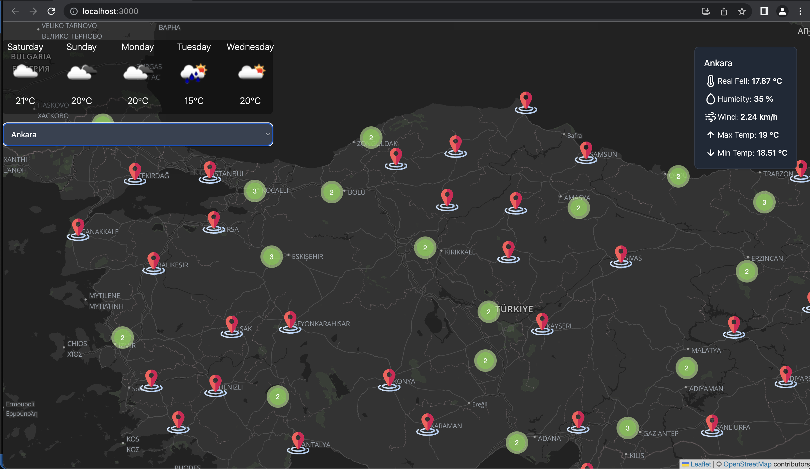

## Weather App Tr

This application is about visualization of weather data with "OpenWeather API". Map library react-leaflet is used.

## Screenshot

## Technologies Used

<ul>
<li>React</li>
<li>Leaflet</li>
<li>Tailwind Css</li>
<li>Context API</li>
</ul>