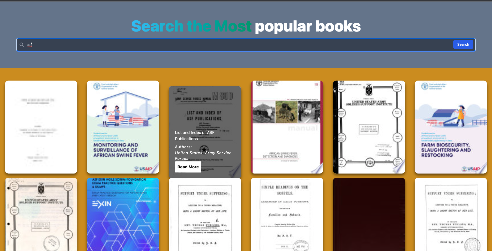

## Book Search 

This application requests the data from the Google Books API according to the entered input and visualizes the incoming data. Made for assignment 6 in FMSS Practice.

## Screenshot

## Technologies Used

<ul>
<li>React</li>
<li>Tailwind Css</li>
<li>Context API</li>
<li>Axios</li>

</ul>